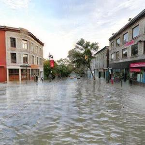
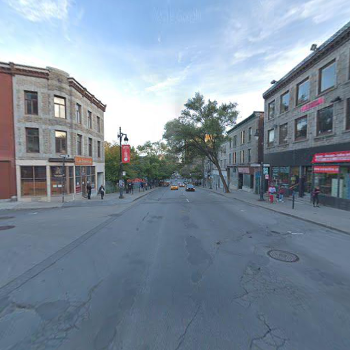
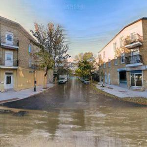
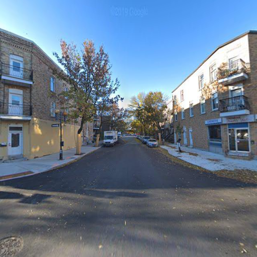

# VICC MUNIT

This repo contains the code adapted from [MUNIT](https://github.com/NVlabs/MUNIT) for the needs of the [VICC project](https://github.com/cc-ai/kdb).


## Requirements
```
pip install -r ./requirements.txt
```
(Not the minimum requirements yet.)

## How to Use

  - [Data](#data)
    - [Type](#type)
      - [Option 1](#option-1)
    - [Option 2](#option-2)
    - [Storage](#storage)
      - [Online](#online)
      - [Mila Cluster](#mila-cluster)
  - [Train](#train)
    - [Continue training](#continue-training)
  - [Test](#test)
  - [Modifications to the original MUNIT](#modifications-to-the-original-munit)
  - [Results](#results)
  - [Experiments run](#experiments-run)

## How to use

Everything in MUNIT is configurable through a `.yaml` file, which can be found in `configs/`. Currently we use [`house2flooded_house256.yaml`](https://github.com/cc-ai/MUNIT/blob/master/configs/house2flooded_house256.yaml)

If you use `train.py` you ***need*** to have the `comet.ml` configuration variables set. Here is the hierarchy:

1. An argument passed to Experiment()
2. An environment variable
3. A setting in the .comet.config file in your current folder
4. A setting in the .comet.config file in your `$HOME` directory

In order not to change every time and comit unnecessarily, it is recommended not to use 1.

For instance, you can have this file as `MUNIT/.comet.config` (which is ignored by git):

```
[comet]
api_key=YOUR-API-KEY
workspace=YOUR-WORKSPACE
project_name=THE-PROJECT
```

Or only the first 2 variables and `$ COMET_PROJECT_NAME=My-Project python train.py --config ...`. For more, [see docs](https://www.comet.ml/docs/python-sdk/advanced/#comet-configuration-variables)

### Data

Munit expects 2 locations with unpaired images.

#### Type

##### Option 1

In the `yaml` config file, for each domain and for `train` and `test`, specify the path to the folder containing the images and a `txt` file listing the images in the fodler to be considered for training/testing. E.g.

```
data_folder_train_a: /network/home/cosnegau/MUNIT/trainA/
data_list_train_a: /network/home/cosnegau/MUNIT/trainA.txt
data_folder_test_a: /network/home/cosnegau/MUNIT/testA/
data_list_test_a: /network/home/cosnegau/MUNIT/testA.txt
data_folder_train_b: /network/home/cosnegau/MUNIT/trainB/
data_list_train_b: /network/home/cosnegau/MUNIT/trainB.txt
data_folder_test_b: /network/home/cosnegau/MUNIT/testB/
data_list_test_b: /network/home/cosnegau/MUNIT/testB.txt
data_list_train_a_seg: /network/home/cosnegau/MUNIT/trainA_seg.txt
data_list_train_b_seg: /network/home/cosnegau/MUNIT/trainB_seg.txt
```

example trainA.txt:

```
/network/tmp1/ccai/data/mapillary/validation/images/dyzWTle6XGPRvdZiFqwMLQ.jpg
/network/tmp1/ccai/data/mapillary/validation/images/sGXE_tiBOjqtidWK_VgUOA.jpg
/network/tmp1/ccai/data/mapillary/validation/images/gxv9RvgHZi_XF11EbJ4Opw.jpg
/network/tmp1/ccai/data/mapillary/validation/images/QV_vTfZC2JSs69XzsbmqXA.jpg
```

#### Option 2

In the `yaml` file, specify a `data_root` field pointing to a folder which contains the files and fodlers listed above 

```
data_root: ./datasets/demo_edges2handbags/     # dataset folder location
```

#### Storage

##### Online

The data we use is not currently available for public re-use. Contact us.

##### Mila Cluster

Raw data is located in `/network/tmp1/ccai/data`

### Train

Specify the parameters in the config `yaml`.

Simply train!

```
python train.py --config configs/house2flooded_house256.yaml
```

#### Continue training

Use `--resume` with the same `output_path` AND for now, for some reason, you need to use the **same name** for the config file...

### Test
Select one input folder containing several images that you would like to flood and a style image from the flooded domain. The style of the latter will be applied to input images et saved in output_folder.
Use the config file saved along with the checkpoints. Checkpoint is the path to the generator checkpoint. 
```
python test.py --configs/config.yaml --checkpoint model_name/checkpoints/gen_00205000.pt --input input_folder/ --output_folder output_folder/ --style style_image.jpg
```
### Modifications to the original MUNIT

### Results

<div class="row">
  <div class="column">
    
  </div>
  <div class="column">
    
  </div>
</div>
<div class="row">
  <div class="column">
    
  </div>
  <div class="column">
    
  </div>
</div>

### Experiments run

https://docs.google.com/spreadsheets/d/1Csdi2B-LJPChLwO1ng4i2sjPgQxrNRlempa05o3a7og/edit?usp=sharing
